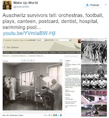
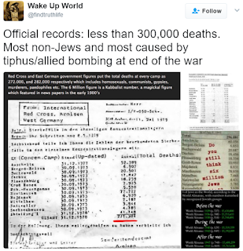

# Holocaust Denial

## Evidence of the Holocaust

### Hitler Was Not A Fan Of Jews

> Once I really am in power, **my first and foremost task will be the annihilation of the Jews**. As soon as I have the power to do so, I will have gallows built in rows — at the Marienplatz in Munich, for example — as many as traffic allows. **Then the Jews will be hanged indiscriminately, and they will remain hanging until they stink; they will hang there as long as the principles of hygiene permit**.** As soon as they have been untied, the next batch will be strung up, and so on down the line, until the last Jew in Munich has been exterminated. Other cities will follow suit, precisely in this fashion, until all Germany has been completely cleansed of Jews. **

\-- Adolf Hitler, [1922](https://www.ifz-muenchen.de/archiv/zs/zs-0640.pdf)

> Today I will once more be a prophet. If the international Jewish financiers in and outside Europe should succeed in plunging the nations once more into a world war, then the result will not be the bolshevization of the earth, and this the victory of Jewry, but **the annihilation of the Jewish race in Europe!**

**-- **Adolf Hitler, [1939](http://www.holocaustresearchproject.org/holoprelude/jewishquestion.html)

> If at the beginning of the war and during the war twelve or fifteen thousand of these Hebrew corrupters of the nation had been **subjected to poison gas**, such as had to be endured in the field by hundreds of thousands of our very best German workers of all classes and professions, then the sacrifice of millions at the front would not have been in vain.

\-- Adolf Hitler, [1939](https://www.historycrunch.com/mein-kampf.html#/)

These seek to establish that Hitler was murderously anti-Semitic and had he gained power (which he eventually did), he probably would want to exterminate Jews (Slavs, Roma, etc),

### Nazis Talking About Murder

* On [18 December 1941](http://www.fpp.co.uk/Himmler/Note181241.html), Himmler asked Hitler, "What to do with the Jews of Russia?", to which Hitler replied, "[to exterminate as partisans](http://www.fpp.co.uk/Himmler/Note181241.html)" . This remark is probably as close as historians will ever get to a definitive order from Hitler for the Holocaust.
* The [Wannsee Protocols](http://holocaust.umd.umich.edu/news/uploads/WanseeProtocols.pdf) outline Nazi plans for "the evacuation of the Jews to the East"; "evacuation" [was a common metaphor for extermination](https://www.museumoftolerance.com/education/teacher-resources/holocaust-resources/what-is-holocaust-denial.html#11).
* A [letter ](https://phdn.org/archives/www.mazal.org/NO-series/NO-0085-000.htm)about "securing skulls of Jewish Bolshevik Commissars for the purpose of scientific research"
* [Numerous reports ](http://www.holocaustresearchproject.org/einsatz/situationreport.html)from the Einsatzgruppen document the killings of Jews
* [Document 501-PS](https://phdn.org/archives/www.ess.uwe.ac.uk/genocide/gasvan1.htm) describes the benefits and drawbacks of gas vans currently used for executions
* The [Posen speeches](https://en.wikipedia.org/wiki/Posen\_speeches) which were two speeches by Himmler in which he speaks about the extermination of the jews.

## Counter Arguments

### Gas Chambers

#### Wooden Doors

.jpeg>)

Do Holocaust deniers think wood is as brittle as cardboard? The wooden doors used in the gas chamber were airtight.

  

All the doors here were used in the delousing and gas chamber rooms are airtight.

The possibility of using wooden doors for Zyklon B delousing chambers was [described by the engineers G. Peters and E. Wüstinger of the firm Degesch (the producer of Zyklon B) in 1940](https://books.google.com/books?id=litDAAAAYAAJ\&focus=searchwithinvolume\&q=%22ausf%C3%BChrung+in+holz%22):

> The chambers should be kept as narrow as possible in order to ensure a sufficiently safe and gas-tight construction for the doors provided at both ends, also those made of wood; if possible, the doors should also have steel frames and the sealing surface (rubber profile or elastic felt strip) should rest on them. In addition to the suitability of the fumigation equipment, the tightness of these doors is of course a decisive factor for successful killing.
>

For the delousing chamber in the concentration camp Flossenbürg [we have the following cost estimate from 12.04.1940](https://anno.onb.ac.at/cgi-content/anno-plus?aid=ztg\&datum=1995\&page=332\&size=45):

> Manufacture and delivery of double-walled wooden doors for gas chamber with sealing edge and closure on all sides as well as frames and thermometers incl. fittings \[...] Puttying and painting with protective paint twice of wooden doors for gas chamber, dimensions from pos. 60.&#x20;
>

&#x20;This receipt [calls for an order](http://www.nizkor.com/hweb/camps/auschwitz/crematoria/order-for-door.html):

> .... order of 6/3/1943 concerning the delivery of a gas tight door 100 x 192 cm for cellar I of Krematorium III, to be produced to the identical pattern and dimensions as the cellar door of Krematorium II which is situated opposite, with peephole of double 8 mm glass, with rubber sealing strip and frame.

#### Zyklon B

The claims range from "Zyklon B can't kill! It's just used to clean lice!" to "Gas chambers don't have the blue residue that comes from Zyklon!".

This [document ](https://phdn.org/archives/holocaust-history.org/auschwitz/19420826-dessau/)of August 26, 1942, gives permission to the Auschwitz concentration camp to send a truck to Dessau, in order to pick up "material for special treatment." Special treatment [being a codeword for murder](https://en.wikipedia.org/wiki/Sonderbehandlung), with the material being [Zyklon B](http://auschwitz.org/gfx/auschwitz/\_thumbs/en/defaultgalerie/713/2/1/20080716\_2011242469\_dok6,oHuCn6impHCVqcKHZpY.jpg).&#x20;

There are absolutely gas chambers that had the blue residue:

As for why some gas chambers don't have residue? Well, thats because you can clean the residue, which the Nazis were attempting to do (as they were trying to erase evidence of the Holocaust), when they realized they were gonna get BTFO.

#### Leuchter report (where's the ventilation?)

.png>)

Honestly, [HolocaustControversies ](http://holocaustcontroversies.blogspot.com/2017/05/rebutting-twitter-denial-most-popular.html#idiotleuchter)covers this pretty well.

#### Survivors didn't see the gas chambers

This comes from a myth that most Jews knew the showers were gas chambers before they were brought into them (I blame [Schindlers List](https://www.youtube.com/watch?v=jjy8Z1hK2wY) for this), but this is [not the case](https://holocaustcontroversies.blogspot.com/2015/08/knowledge-of-mass-extermination-among.html).

To illustrate this, consider the [case of a survivor named Maria Vanherwaarden](http://web.archive.org/web/19990421163441/http://ihr.org/books/kulaszka/21herwaarden.html):&#x20;

> From Linz, Herwaarden was transported to Vienna and from there to Auschwitz. There were about twenty other women on the train travelling from Vienna to Auschwitz. She could not say if any were Jewish. They received food on the train. A gypsy told Herwaarden that they were going to be gassed when they arrived at Auschwitz. They arrived in the camp on 2 December in the afternoon. (25-6625, 6626, 6627) That night the SS people came and took them to Birkenau. They were taken to a cold, windowless room and told that they had to take a cold shower. They handed over their clothes and all hair was shaved, both head and pubic. Herwaarden was "terribly scared" when she went into the shower room because "they said gas would be coming from the top but it was only water." They received soap, but the water was cold. When they finished, they received their numbers and prisoners clothing and were taken to the barracks. Herwaarden was listed as an Aryan. (25-6628, 6629)

Obviously someone who has survived the holocaust wouldn't see a gas chamber? If they did, they would be most likely lead to one and killed. Vanherwaarden did not see the gas chambers, but she did hear of them. Does Vanherwaarden never having seen the crematoria prove that they didn't exist? Obviously not, only that she personally didn't see them.

### Auschwitz had a swimming pool and a brothel!

Auschwitz consisted of numerous sub-camps and served many functions, among them: a POW camp, a labor camp, a detention camp, an extermination camp. There were tens of thousands of non-Jewish inmates in Auschwitz and its sub-camps too, who as a rule were subjected to a different treatment than Jews. And of course there were [thousands of SS men who had to be entertained in their free time](http://auschwitz.org/en/museum/news/the-lighter-side-of-auschwitz-or-the-cultural-life-of-the-ss-in-the-death-camps,483.html). The existence of these festivities do not disprove the Holocaust.

#### The Swimming Pool

It's NOT a swimming pool, its actual function was a firefighting water reservoir, with the diving board added for secondary use as a swimming pool of which was only accessible to SS men and certain privileged Aryan prisoners employed as inmate-funcionaries in the camp.

#### Brothel

The brothel of which was NOT for Jewish prisoners.

#### Sports Association

That was only allowed for [Reichsdeutschen](https://phdn.org/archives/holocaust-history.org/auschwitz/pressac/technique-and-operation/pressac0507.shtml) ("imperial germans")

### Muh Red Cross

This includes two claims:

* Red cross records debunk the Holocaust
* The red cross inspected the death camps and found nothing

#### Death Camps Claim

In its official report the Red Cross states very explicitly that they were not allowed to visit all the camps: (p. [625](https://archive.org/details/ReportOfTheInternationalCommitteeOfTheRedCrossOnItsActivitiesDuringTheSecondWorl/Report%20of%20the%20International%20Committee%20of%20the%20Red%20Cross%20on%20its%20activities%20during%20the%20second%20world%20war%20\(September%201%2C%201939%20-%20June%2030%2C%201947\)%20Vol%201/page/n625/mode/2up), [643](https://archive.org/details/ReportOfTheInternationalCommitteeOfTheRedCrossOnItsActivitiesDuringTheSecondWorl/Report%20of%20the%20International%20Committee%20of%20the%20Red%20Cross%20on%20its%20activities%20during%20the%20second%20world%20war%20\(September%201%2C%201939%20-%20June%2030%2C%201947\)%20Vol%201/page/n643/mode/2up))

> It should be stressed that the powers of the ICRC for help and protection **could not be extended to all concentration camps; there were numerous camps and labour detachments of which they had no knowledge, or to which they were denied access until the end of hostilities.**

> Whereas **other camps exclusively reserved for Jews were not open to inspections for humanitarian purposes until the end**, the Committee's activities were at least effective in several concentration camps containing a minority proportion of Jews.

In fact the Red Cross complained about the lack of an access already during the war, [as can be seen from the letter of 21.07.1943](https://babel.hathitrust.org/cgi/pt?id=uiug.30112039810327;view=1up;seq=283):&#x20;

> You will see from the enclosed that it is, **unfortunately, extremely difficult for the International Red Cross Committee to help the Jewish population in Germany and the occupied countries. As we have written to you before, the German authorities do not consider the civilians who are arrested in occupied countries, including France, as civilian internees, thereby excluding them from the application (by analogy) of The Geneva Convention regarding Prisoners of War. **The International Red Cross Committee's field of action, **unfortunately, does not include this large category, known as "detained civilians". Inasmuch as it is impossible for the International Committee to visit the camps where these people are interned, the Committee is not in a position to check on the distribution of relief supplies. For this reason these concentration camps are not included in the category of internment camps to which the Blockade authorities allow relief supplies from overseas to be sent.** Furthermore, the International Red Cross Committee does not receive any lists of the names of the Detained Civilians.

When the Red Cross representative Maurice Rossel tried to visit Auschwitz (Auschwitz I, not Auschwitz II Birkenau where the actual extermination camp was), [all he was allowed to do is talk to the commandant for about half an hour](http://holocaustcontroversies.blogspot.com/2015/09/kollerstroms-deception-on-visit-of.html).

#### Records Claim


Even if one were to assume that those are death tolls of registered inmates in the camps, the letter **is still useless for the deniers since most Holocaust victims** (and hence also their deaths) **have never been claimed to have been registered in the camps** (most were murdered before any camp registration took place). Literally, **most of the camps' victims were not registered as camp inmates**. That's basic history.

