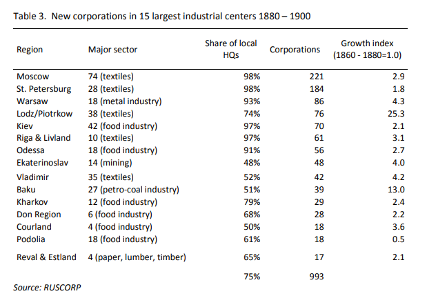

# Counteraguments

## Claim: "That wasn't real socialism!"

Let's say I have a theory, let's call it rainbowism. We want to create a rainbowist society which means that food will fall from rainbows for the workers--no one will have to work for anything anymore. And I get a group of rainbowists together and we take over a country. We set about implementing the rainbowist policy program. We shoot water into the air to create more rainbows, drop water from big airplanes, excitedly forecast the next storm which will produce rainbows, put rewards out for the capture of Leprechauns, and force everyone at gunpoint to pray to the big rainbow in the sky to give us food and plenty. It doesn't work. Meanwhile the farming and trade isn't getting done, because we are diverting the energy of the country into pursuing rainbowism. And we say, pray harder! Dump more water! The rainbows will come and give plenty to all! Meanwhile, people are starving and dying. And then I come along and say, you silly fools, you're never going to get a rainbow to give you free food! Quit trying! I say rainbowism has ruined the country. And along comes a true believer in rainbowism and says, no, rainbowism didn't ruin the country, the country never achieved rainbowism at all because free stuff never fell from the sky which is the definition of rainbowism, so obviously **this is not the fault of rainbowism or rainbowists, right?**

## **Claim: "The** [**Waitzkin study**](https://sci-hub.se/10.2190/AD12-7RYT-XVAR-3R2U) **proves that poor socialist countries having higher development than poor capitalist/non socialist countries!"**



## Claim: "The [Navarro study](https://sci-hub.se/10.2190/B2TP-3R5M-Q7UP-DUA2) proves socialism is good!"

Commies will cite this study but leave it out of context, if you read the study it says:

> the socialist experience \(in both its Leninist and its social democratic traditions\) has been, more frequently than not, more efficient in responding to human needs than the capitalist experience.

Even the study "proving" socialism as good agrees that social democracy is a good system.

They try to say that Socialism is better for Latin America because Cuba has a higher life expectancy:

> Since then, the health indicators have improved more rapidly in Cuba than in the rest of Latin America.

The problem with citing life expectancy for Cuba is that they're heavily skewed by the regime. [Econlib ](https://www.econlib.org/about-that-cuban-life-expectancy/)writes: 

> Cuba, with a ratio of 6, was a clear outlier. **This skewed ratio is evidence that physicians likely reclassified early neonatal deaths as late fetal deaths, thus deflating the infant mortality statistics and propping up life expectancy**.

> Coercing or pressuring patients into having abortions **artificially improve\[s\] infant mortality by preventing marginally riskier births from occurring help\[s\] doctors meet their centrally fixed targets**.

They also claim that China is a socialist success because life expectancy has improved over feudal china: 

> Furthermore, although health indicators have improved significantly in China as 
  
> compared with India, they have done so at similar levels of per capita GNP. China has 
  
> much better health indicators at similar per capita GNP levels

Not only is Feudal China [**an embarrassingly low bar**](https://en.wikipedia.org/wiki/Taiping_Rebellion), [**China isn't even socialist anymore, they are a capitalist economy, they have been since 1983**](https://en.wikipedia.org/wiki/Chinese_economic_reform). This study was done in 1992 to be fair, so they couldn't have foresaw the [**giant improvements China has made ever since capitalism**](https://www.forbes.com/sites/rainerzitelmann/2019/07/08/chinas-economic-success-proves-the-power-of-capitalism/?sh=63cd9bc53b9d). Also, life expectancy \(and health\) has [massively been improved by Capitalism](general/capitalism.md#health).

## ECP

### Claim: "Walmart proves Central Planning works!"

Companies like Walmart or Amazon use price signals to determine whether or not to do certain things, they still have a common denominator to compare different factors of production to commensurate them.

Read more, [here](https://cdn.mises.org/qjae_23_1_kounya.pdf).

### Claim: "Computers can central plan!"

 Computers don't disprove the idea that you still need prices for an economy to work, it'd still run into the same calculation problem but it run into faster because it's a computer.

Joe Kane in this SSRN paper [finds](https://0x0.la/u/xpgFpqO.pdf): 

> Central planning, using the Internet or any other means, **still cannot dispense with the competitive market process without which the discovery of the information** **necessary for economic calculation is impossible**

The Quarterly Journal of Austrian Economics supposed that there are 6 billion people on earth, and that there are 80,000 different consumer goods, even when they use the TOP500 supercomputers, they [find](https://cdn.mises.org/qjae16_2_5.pdf):

> For example, even under severe simplifying assumptions, distributing 80,000 heterogeneous consumer goods among six billion heterogeneous consumers **requires a calculation that would take at least 10.5 quintillion years—when the Big Bang happened just 14 billion years ago**.

## Marxism-Leninism

### Claim: "Grover Furr proved Stalin didn't do anything wrong!"

Grover, for all intents and purposes, is a **pseudo-historian to the likes of David Irvings and other neo-Nazi historians.**



### Claim: "The USSR [was the 2nd fastest growing economy in the World!](https://web.williams.edu/Economics/brainerd/papers/ussr_july08.pdf)"



### **Claim: "The USSR had the most physicians per capita!"**



### Claim: "The USSR had higher nutrition and calorie consumption than the US!"



### Claim: "The Gulags weren't that bad!"

> Report from the CIA which found some interesting things about the gulags, including that between 65% and 95% of prisoners \(depending on the camp\) were imprisoned for genuine crimes \(such as theft, murder, rape, etc.\) rather than political offenses.

~~nice that the source library is trying to justify gulags x3~~

So what? This sounds like when a conservative argues "He didn't deserve it but.... He was no angel!" when a black person is killed by a cop. 

Just because some of the prisoners may have committed a legitimate crime doesn't excuse the terrible almost slave-tier working conditions these prisoners faced. **Remember that 1.6 million people died there, that doesn't even happen in US prisons**, assuming the gulag ran for 25 years, **that's literally 176 deaths per day**.

Andrei Vyshinsky, chief procurator of the Soviet Union, wrote a memorandum to NKVD chief Nikolai Yezhov in 1938 [which stated](https://web.archive.org/web/20090224230330/http://atlasandco.com/images/uploads/samples/pdf/InsideStalinArchives-web.pdf):

> Among the prisoners there are some so ragged and lice-ridden that they pose a sanitary danger to the rest. These prisoners h**ave deteriorated to the point of losing any resemblance to human beings**. **Lacking food…they collect orts \[refuse\] and, according to some prisoners, eat rats and dogs**.

During the Holodomor, ****[**prisoners were getting around 300 calories \(1,300 kJ\) worth of food a day. Many inmates attempted to flee, causing an upsurge in coercive and violent measures. Camps were directed "not to spare bullets"**](https://bafykbzaced642r3wd3hxlzurbihrkhy3bp5apb3tyupftafdggxfjmkwtbwtm.ipfs.infura-ipfs.io/?filename=%28Annals%20of%20Communism%20Series%29%20Oleg%20V.%20Khlevniuk%20-%20The%20History%20of%20the%20Gulag_%20From%20Collectivization%20to%20the%20Great%20Terror-Yale%20University%20Press%20%282004%29.pdf#page=84).

### Claim: "But Commies contributed to technology!"

Commies also contributed to pseudoscience.

All humanities and social sciences were **additionally tested for strict accordance with historical materialism**. These tests were [**alleged to serve as a cover for political suppression of scientists who engaged in research labeled as "idealistic" or "bourgeois"**](https://cloudflare-ipfs.com/ipfs/bafykbzacebfdfdmslglraojxtilspavuikhsdmmpbg7wpuq6apfppp66fma34?filename=%28Cambridge%20Studies%20in%20the%20History%20of%20Science%29%20Loren%20R.%20Graham%20-%20Science%20in%20Russia%20and%20the%20Soviet%20Union_%20A%20Short%20History-Cambridge%20University%20Press%20%281993%29.pdf).

\*\*\*\*[**Over 3,000 biologists were imprisoned, fired, or executed** **for attempting to oppose Lysenkoism**](https://link.springer.com/content/pdf/10.1007/s13238-011-1011-8.pdf) \(a theory that rejects natural selection\). Due to Lysenkoism, [**crop yields in the USSR actually declined**](https://www.wsj.com/articles/the-scourge-of-soviet-science-1466192179).

Certain cosmological models, in particular of the big bang type, [**were declared pseudo-scientific and idealistic because they implied a cosmic creation, a concept which was taken to be religious**](https://arxiv.org/ftp/arxiv/papers/1204/1204.1625.pdf).

Antony Sutton looked at hundreds of official and unofficial Western and Soviet sources and abounding in statistical charts, tables, footnotes, and appendices and[ finds that](https://ia802302.us.archive.org/0/items/pdfy-Iqz3ytYcb3wWYJ0c/Antony%20Sutton%20-%20The%20Best%20Enemy%20Money%20Can%20Buy.pdf): 

> In a few words: **there is no such thing as Soviet technology**. **Almost all — perhaps 90-95 
  
> percent — came directly or indirectly from the United States and its allies.** **In effect the 
  
> United States and the NATO countries have built the Soviet Union**. Its industrial and its 
  
> military capabilities. This massive construction job has taken 50 years. Since the Revolution 
  
> in 1917. It has been carried out through trade and the sale of plants, equipment and technical 
  
> assistance.

### Claim: "Socialism industrialised Russia!"

Note that I'm not gonna defend Tsarist Russia, both it and the USSR were terrible, but the claim that Russia wasn't industrialised before socialism would be a lie,[ Nooa Nykänen 2015 ](https://jyx.jyu.fi/bitstream/handle/123456789/46000/URN:NBN:fi:jyu-201505221958.pdf#page=41)looks at major sectors during the Tsar and finds they were pretty industrialised:

## Venezuela

### Claim: "Venezuela High Reliance on Oil Harmed them, not Socialism!"



### Claim: "Sanctions Destroyed Venezuela"

This [study ](https://www.brookings.edu/wp-content/uploads/2019/05/impact-of-the-2017-sanctions-on-venezuela_final.pdf)by the Brookings Institute finds that:

> While we recognize the possibility that the sanctions may have had some impact on Venezuela’s oil production, our analysis finds insufficient evidence to conclude that they were responsible for the worsening of the socio-economic crisis.

Furthermore, sanctions [began in 2015](https://en.wikipedia.org/wiki/International_sanctions_during_the_Venezuelan_crisis#2015), while the crisis began in 2010, did they travel back in time?

